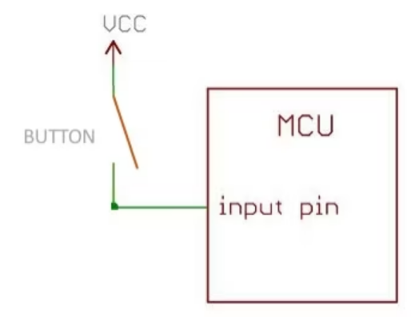
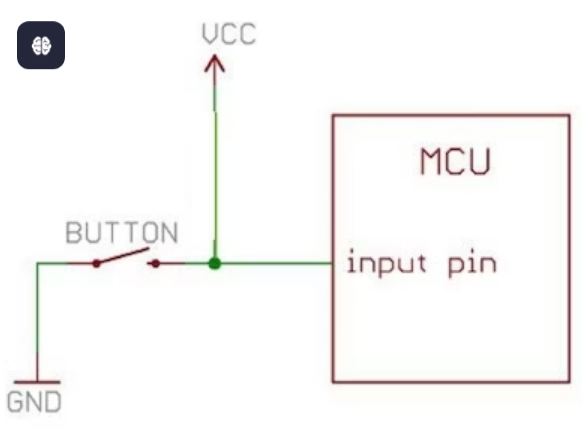
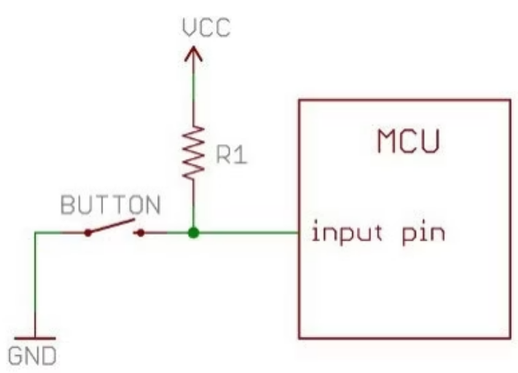
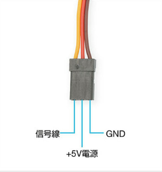
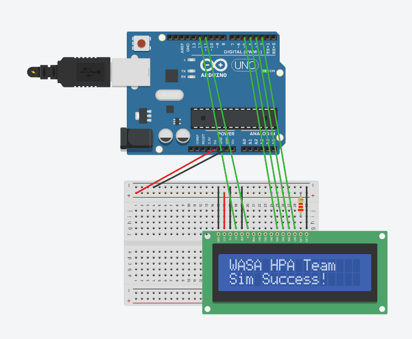
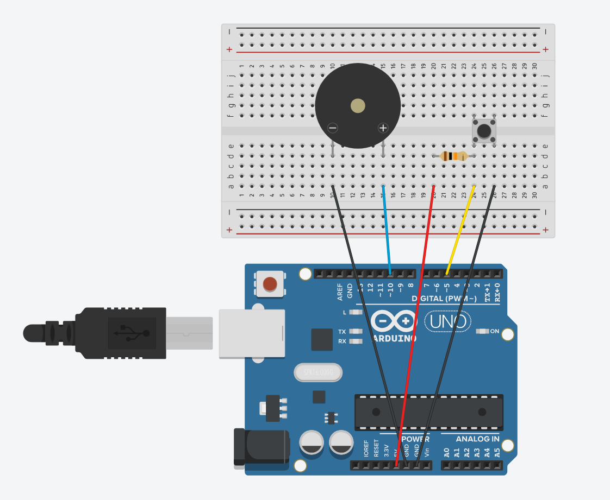
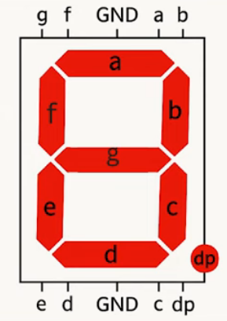

# 2026年 1月 学習ログ

## 2026-01-28

### 取り組んだこと
- LED点灯
- Lチカ
- チャタリング(プログラムの工夫だけは行ったが、ハードウェアの工夫はシュミットトリガーがないので今度)
- 可変抵抗(キットに可変抵抗が無かったのでまた今度)
- プルアップ抵抗・プルダウン抵抗

### 学んだこと・メモ

#### チャタリング
金属板を端子に付ける際、金属板が金属板と接続されるまで、金属板と金属板が接続されている状態になることを**チャタリング**という。チャタリングを回避するには、**プログラムの工夫**と**ハードウェアの工夫**がある。

1. プログラムの工夫

チャタリングはごく短い時間に発生させるので、チャタリングが起こっている間は、一時的に待機させる。
```cpp
if (digitalRead(SWITCH_SOCKET) == 1){
    delay(100);
    count = count + 1;
}
```
2. チャタリング防止回路

待機する時間が長かったりする場合は、チャタリング防止回路をスイッチの出力後に作成しておく。


抵抗は**急激に電荷が流れるのを阻止**する。コンデンサは**電圧の変化を緩やかにする特性**がある。この2つの特性により、チャタリングが発生している部分を影響がない状態にできる。

チャタリングが終わった後は、抵抗とコンデンサの影響で電圧が緩やかにVddになってしまう。そこで、**シュミットトリガー**と呼ばれるICを利用することで出力を0からVddへ急激に切り替えることが可能になる。図の74LS14と74HC14は、インバータが実装されているため、2つ通すことで正しい出力が得られる。

#### 可変抵抗
可変抵抗には、つまみを付けて自由に変化できる**ボリューム**と一度調節したら通常は抵抗値を変えない**半固定抵抗**の2種類がある。
可変抵抗には3つの端子があり、そのうち2つの端子は抵抗素子の両端に接続されている。つまり、両端の端子間は**ボリュームの最大抵抗値**を表す。もう1つの端子は、抵抗素子場を動かせるようになっている。この抵抗素子場を動かすことで、抵抗値を変更することができる。

#### 危険な回路
1. オープン回路


ボダンがOFFのとき、完全に**インプットピンが宙ぶらりん**になってしまう。

2. 短絡回路


これは大事故につながってしまう。ボタンにかかっていく電圧とインプットピンにかかる電圧は等しい。**ボタンの抵抗値は0に等しいのでショート回路**となる。

#### プルアップ回路
デジタル入力ピンは、内部抵抗が極めて高いため、どこにも接続されていないと周辺のわずかなノイズに反応して電位が激しく変動し、**フローティング状態**となる。これを避けるために、**プルアップ回路**を構成する。



**インプットピンを抵抗を介してVCC側に接続する**構成。スイッチはピンとGNDの間に配置される。

1. スイッチが**OFF**のとき

**入力ピンの内部抵抗は極めて高い**ため、回路全体の電流は0に等しい。

電流がほぼ0であるため、プルアップ抵抗での電圧降下もほぼ0となり、**入力ピンに印加される電圧は電源電圧とほぼ等しく**なり、ピンは**HIGH**状態で安定する。

2. スイッチが**ON**のとき

インプットピンが直接GNDに接続される。電流は電源から抵抗を通り、スイッチを経由してGNDへと流れる。このとき、ピンの電位はGNDと等しくなるため、ピンは**LOW**状態で安定する。

## 2026-01-29
### 取り組んだこと
- モーター制御
- サーボモーターの制御
- 超音波センサ
- シリアル通信

### 学んだこと・メモ

#### モーター制御
**PWM**は疑似的にアナログ出力が可能。0Vと5Vを高速で切り替えることで、0Vと5Vの間の電圧を作り出すことが出来る。例えば、3Vの電圧を得たい場合、5Vの時間を3、0Vの時間を2の割合で出力するようにする。

モーターを制御する場合は、Arduinoのデジタル出力のソケットに直接つないではいけない。モーターを駆動するには、比較的大きな電流が流れなければならないので、**モーター制御用IC**を使用する。

#### サーボモーターの制御
サーボモーターは**特定の角度まで回転しその状態を保持する動作**をする。サーボモーターの目的の角度は**パルス幅**で決まる。

サーボモーターを制御するパルス幅は、どのメーカーでも似た決まりとなっている。
多くの場合、動作の中心が1.5msで、1度動かすごとに±0.1ms程度パルスを増減する。



サーボモーターには3つの導線がついている。赤は5V電源、茶色はGND、オレンジにはPWM信号を入力する。
PWM出力には、PD3,5,6,9,10,11のいずれかを使用する。

#### 超音波センサ
超音波センサは、超音波を発射して、反射波を拾うことで距離を測定する。


`T`と書いてある方がTransmit、`R`と書いてある方がReceiveを表す。端子は左からVCC,Trig,Echo,GNDの順で接続する。

多くの超音波センサは、10µs以上のTrigピンからのHIGH信号を受け取ると、超音波を発射する。その後`pulseIN`関数を使用してEchoピンを自動的にHIGHにし、LOWになるまで待つ。

#### シリアル通信
1. 基本概念

シリアル通信にもいくつかの種類があり、Arduinoが採用しているのは**UART**という規格である。
- 1対1の通信：基本的に2つのデバイス間で行われる
- 非同期通信 : CLK信号がなく、代わりにBaud Rateという通信の約束事を事前に決めて通信を行う

2. 通信速度

1s間に送るビット数で表され、単位はbps(bits per second)。
- 9600: 標準的。安定しているが遅い。
- 115200: 高速。大量のデータを送る際に向いている。

送信側と受信側の設定が一致していないと、文字化けや通信エラーが発生する。

3. UARTのパケット構成
シリアル通信では、1byteのデータを送る際に、その前後に制御ビットを付加する。
- Start Bit: 通信の開始(立下り)
- Data Bit: 通常は8bit
- Parity Bit: 誤り検出用
- Stop Bit: 通信の終了(立上り)

#### I2Cでデバイス制御
I2Cとは、**2線式の同期式シリアル通信**。

1. 基本構成

I2Cは、**SDAとSCL**の2本の信号線だけで構成される。
- 同期式通信: UARTと違い、専用のCLK信号(SCL)があるため、ボーレートの設定ミスによる文字化けが起きない
- マルチマスター・マルチスレーブ：1つのバス上に複数のデバイスをぶら下げることが出来る。

2. ArduinoのI2C端子(配線例)


3. Arduinoでの実装

ArduinoでI2Cを使うには`Wire.h`をインクルードする。

4. I2Cデバイスのアドレス

各I2Cデバイスにはアドレスが割り当てられている。0x03から0x77までの**117個のアドレスが利用できる**。

I2Cデバイスのアドレスを調べるには[i2c_scanner](https://github.com/asukiaaa/I2CScanner)プログラムを、Arduinoへ転送して調べる。

#### UARTとI2C
I2Cはプルアップ抵抗で信号を引き上げるため、配線が長くなると**寄生容量の影響**で通信エラーが激増する。それに対し、UARTは長距離伝送にも耐えられる。

また、**UARTはFull-Duplex**だが**I2CはHalf-Duplex**である。


### 次回の取り組み
モーターとサーボモーターに接続したとき、
```bash
avrdude: ser_open(): can't set com-state for "\\.\COM3"
```
というエラーが出た。

Surface Laptop5で実行したが、**PCのUSBポートから供給される電力で賄えなかった可能性**がある。電圧が不安定になったことで、Arduino上の通信チップがフリーズし、PC側からは通信が異常終了した。しかし、WindowsはCOM3ポートはまだ使用中だと認識し、他のプログラムがアクセスできないようにロックをかけたのだと考えられる。

対応策としては、**USBポートを変更する**か、**Arduinoの電源供給を外部電源に変更する**かを考える。

超音波センサでは、今回は室温条件下で測定したため、実測値との差は小さかったが、より精密に測定する場合、**温度計を併用して測定する必要がある**。

## 2026-01-30

### 取り組んだこと
- [有機ELキャラクタデバイス](/projects/displays/organic_el/organic_el.ino)
- Tinkercadの使い方を学んだ
- ブザー
- カルマンフィルタ
- 7セグメント

### 学んだこと・メモ
#### 電圧が異なるデバイス間をつなぐとき
**レベルコンバータ**を使用する。3.3Vで動作するデバイスと5Vで動作するデバイスを接続する際に使用する。
#### Tinkercad
配線が複雑になってきた。Tinkercadでシミュレーションを行う。今回作った[LCDの接続](https://www.tinkercad.com/things/h5vjEc0jDTX/editel?returnTo=%2Fdashboard)を確認するのに役立った。

#### 有機ELキャラクタデバイス
1. 電源と表示の基本
- VSS : GND
- VDD : 5V
- V0 : 電源と文字の濃さを決める。**GNDに直結すると文字が最も濃く表示される**。**文字のコントラストを調整したい時は、ここに抵抗を入れるなりして調整する**。
- RW : Highで読み込み、Lowで書き込み。今回はArduinoから命令を書き込むだけなのでGNDに接続する
2. 通信の要
- RS : Arduinoが送るデータが**命令**なのか**文字**なのかを切り替えるスイッチ。Highで表示する文字、Lowで命令。
- E : データを読み込ませるための信号。Highで書き込み、Lowで読み込み。
- D0-D7 : **データをやり取りする8本の線**。今回は4bitモードで制御するので、D4-D7の4本を使用する。

#### ブザー
内部にコイルと金属板が入っており、**コイルにプラスマイナスの電圧を加えると金属板が振動し音を鳴らす**。

ブザーには**パッシブブザー**と**アクティブブザー**の2種類がある。
- アクティブブザー : 内部回路があり、DC電圧をかけるだけで決まった音を出していく。
- パッシブブザー : 内部の制御信号はなく、外からのパルス信号を入れることで音を出す。



#### 7セグメントディスプレイ
8個の細長いLEDが1つのパッケージに収まったもの。それぞれのセグメントにはa-g、そしてドットのDPという名前が決まっている。



全てのLEDのカソードが1つにまとめられている(カソードコモン)ので、共通ピンを**GND**につなぐ。

また、7セグはLEDの集まりなので、そのまま電圧をかけると焼き切れる。そのため、各セグメントに対して**220Ω-1kΩ**程度の抵抗を直列に入れる。

今回は、ボタンを押すと擬似乱数を生成し、7セグに表示するプログラムを作成した。


擬似乱数のシードを作る手法としては、以下の3通りがある。

1. アナログピンのノイズ

もっともポピュラーな手法。何も接続していないアナログピンが、周囲の電磁ノイズを拾うことで生成可能。`randomSeed(analogRead(A0))`でシードを初期化する。導入が最も簡単だが、周囲の環境に左右される。

2. ユーザーの操作タイミング

人間がボタンを押すタイミングは、マイコンの動作クロックに比べれば不正確である。この不正確さを利用してシードを生成する。

3. 外部環境センサーの利用

温度、湿度、気圧、加速度などのセンサー値のLSBを利用する。追加パーツが必要だが、精度は高い。

乱数の質を高める手法としては、以下の手法がある。
- ビットの結合: 複数のピンの値をXORで合成することにより、ノイズの偏りを打ち消す。
- 範囲の重みづけ

厳密なランダム性、暗号化を求める場合は、ESP32などの**ハードウェアRNG搭載マイコン**を使う。

#### カルマンフィルタ

カルマンフィルタは、誤差を含む観測値から、システムの**状態**を推定するための無限インパルス応答フィルタの一種。

特に、「現在の推定値」と「新しい観測値」を、それぞれの信頼度（誤差分散）に基づいて重み付け合成（加重平均）することで、真の値に最も近い値を算出する。

##### 基本的な考え方
システムの状態更新は以下の2つのステップの繰り返しで行われる。

1.  **予測**: 前回の状態から、今の状態を予測する。
2.  **更新**: 実際に得られた観測値を使って、予測値を修正する。

今回は、超音波センサーで距離のみを測定する1次元のセンサー値（静止または緩やかに動く物体）を対象とした。つまり「次の状態は現在の状態と同じである」という単純なモデルを仮定することが多い。今回の実装では、以下の数理モデルに基づいて実装を行った。

##### 変数の定義
- $x_k$: 推定値
- $z_k$: 観測値 - センサーから読み取った生の距離
- $P_k$: 推定誤差の共分散
- $K_k$: カルマンゲイン
- $R$: 観測ノイズの共分散 -> パラメータ `mea_e`
- $Q$: プロセスノイズの共分散 -> パラメータ `q`

##### 更新プロセス

##### カルマンゲインの計算
まず、現在の観測値をどれだけ信頼すべきかを表す係数（カルマンゲイン $K$）を計算する。

$$ K_k = \frac{P_{k-1}}{P_{k-1} + R} $$

*   推定誤差 $P$ が大きく、観測誤差 $R$ が小さい場合 $\rightarrow K$ は $1$ に近づく（観測値を重視）。
*   推定誤差 $P$ が小さく、観測誤差 $R$ が大きい場合 $\rightarrow K$ は $0$ に近づく（過去の推定を重視）。

#### 推定値の更新
予測値と観測値を、カルマンゲインを使って合成する。

$$ x_k = x_{k-1} + K_k (z_k - x_{k-1}) $$

*   $K \approx 1$ のとき: $x_k \approx z_k$ （観測値そのものに近づく）
*   $K \approx 0$ のとき: $x_k \approx x_{k-1}$ （前の値を維持する）

##### 推定誤差の更新
次回のステップのために、推定値の信頼度（誤差）を更新する。

$$ P_k = (1 - K_k) P_{k-1} + Q $$

ここで加算される $Q$（プロセスノイズ）が、**時間の経過とともに不確かさが増える**ことを表現している。この $Q$ がないと $P$ は限りなく0に近づき、新しい観測値を無視して値が固定化されてしまう。

#### パラメータの調整

実装コードにおいては、以下のパラメータ調整が重要となる。

```cpp
SimpleKalmanFilter simpleKalmanFilter(mea_e, est_e, q);
// 例: simpleKalmanFilter(2, 2, 0.01);
```

##### `mea_e`
**センサーがどれくらい信用できないか**を示す値。
*   **物理的な意味**: センサーのスペックや実測データのばらつき（標準偏差など）に相当する。
*   **調整**: HC-SR04のような超音波センサーであれば、数cmの誤差は常に生じるため、`2`〜`5` 程度が妥当である。
*   **効果**: 値を大きくすると、突発的なノイズに強くなるが、応答性は下がる。

##### `q`
**対象物の動きがどれくらい不規則か**を示す値。
*   **物理的な意味**: システム（距離）の変化の激しさ。
*   **調整**: ここがチューニングの肝となる。
    *   **静止物を測る場合**: `0.001`〜`0.01` (極めて小さくする)。値はほとんど変化しないと仮定し、強力に平滑化する。
    *   **動く物を測る場合**: `0.1`〜`0.5` (大きくする)。値は変化するものと仮定し、追従性を高める。
*   **効果**: 
    *   小さすぎる $\rightarrow$ 実際の距離変化に対して数値の変化が遅れる（ラグが発生する）。
    *   大きすぎる $\rightarrow$ ノイズ除去効果が薄れ、値がブレる。

##### 推奨される調整手順
1.  `mea_e` はセンサーの精度に合わせて固定する（例: 2）。
2.  `q` を `0.01` から始める。
3.  実際に物体を動かしてみて、追従が遅いと感じれば `q` を大きくする。
4.  静止しているのに値がふらつく場合は `q` を小さくする。